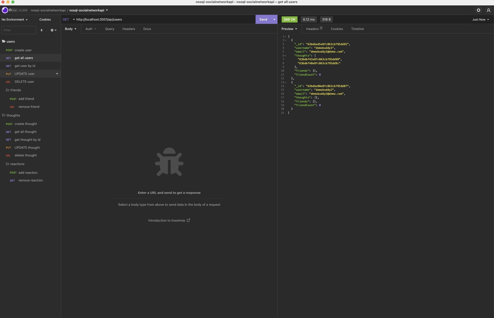

# NOSQLSocialNetwork

## Table of Contents

- [Description](#description)
- [Technology](#Technology)
- [Installation](#installation)
- [Usage](#usage)
- [License](#license)
- [Questions](#questions)

## Description:

It is an API for a web application for a social network where users can share their thoughts, respond to those of friends, and make a friend list.

## Technology:

Project is created with:

- Javascript
- Node.js
- Express.js
- MongoDB
- Mongoose

## Installation

Install this project locally using npm to run it:

```
npm install
```

## Usage

The following command will be used to launch the application following the installation of npm packages:

```
npm start
```

#### Walkthrough Video

[Click me to see the demo video!][link](https://youtu.be/NmuiCTdzXak)

#### Insomnia Screenshot




## License  
This project is covered under the No License license.

## Questions
Have questions about this project?  
GitHub: https://github.com/Vsoto7697  
Email: Vsoto7697@gmail.com